# SerbisyoHub PH — Architecture Diagrams

> Historical snapshot: references to the repository-local Express/AWS backend
> describe retired infrastructure removed in July 2026. The mobile runtime now
> uses the deployed SHPH API.

> Generated from codebase exploration. The app currently runs in **Supabase-primary mode**; the SHPH REST API layer is wired but disabled via `ApiConfig.preferShphApi = false`.

---

## 1. High-Level System Context

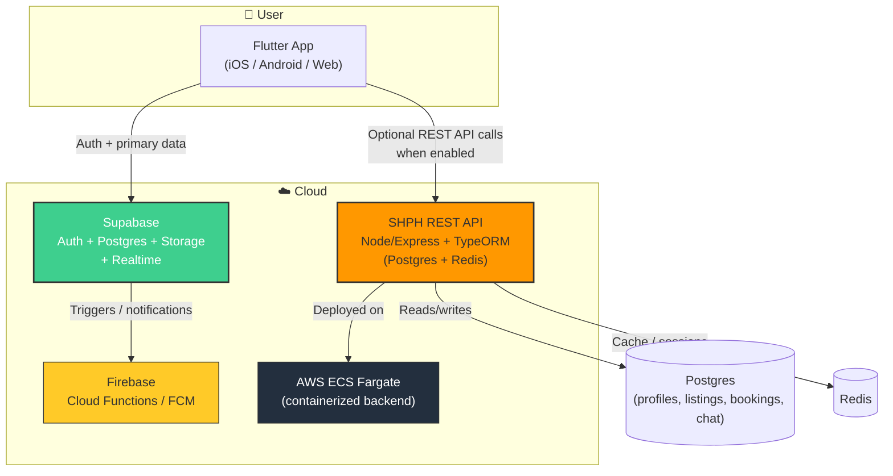
```mermaid
flowchart TB
    subgraph User["👤 User"]
        Mobile["Flutter App\n(iOS / Android / Web)"]
    end

    subgraph Cloud["☁️ Cloud"]
        Supabase["Supabase\nAuth + Postgres + Storage\n+ Realtime"]
        SHPH["SHPH REST API\nNode/Express + TypeORM\n(Postgres + Redis)"]
        Firebase["Firebase\nCloud Functions / FCM"]
        AWS["AWS ECS Fargate\n(containerized backend)"]
    end

    Mobile -->|Auth + primary data| Supabase
    Mobile -->|Optional REST API calls\nwhen enabled| SHPH
    SHPH -->|Reads/writes| SupabasePostgres[("Postgres\n(profiles, listings, bookings, chat)")]
    SHPH -->|Cache / sessions| Redis[(Redis)]
    Supabase -->|Triggers / notifications| Firebase
    SHPH -->|Deployed on| AWS

    style Supabase fill:#3ecf8e,stroke:#333,stroke-width:2px,color:#fff
    style SHPH fill:#ff9800,stroke:#333,stroke-width:2px
    style Firebase fill:#ffca28,stroke:#333
    style AWS fill:#232f3e,stroke:#333,color:#fff
```

---

## 2. Flutter App Layer Architecture

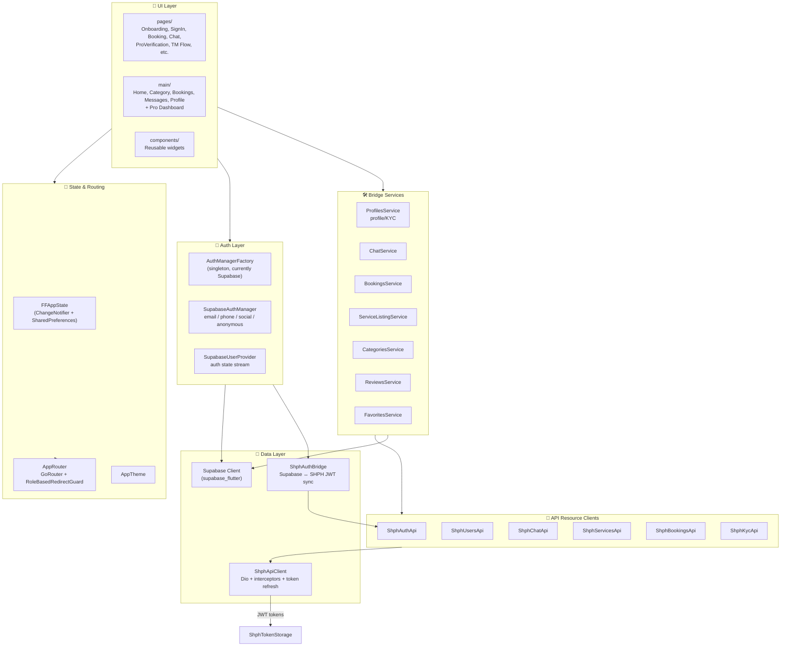
```mermaid
flowchart TB
    subgraph UI["📱 UI Layer"]
        Pages["pages/\nOnboarding, SignIn, Booking, Chat,\nProVerification, TM Flow, etc."]
        Main["main/\nHome, Category, Bookings, Messages, Profile\n+ Pro Dashboard"]
        Components["components/\nReusable widgets"]
    end

    subgraph State["🧠 State & Routing"]
        AppState["FFAppState\n(ChangeNotifier + SharedPreferences)"]
        Router["AppRouter\nGoRouter + RoleBasedRedirectGuard"]
        Theme["AppTheme"]
    end

    subgraph AuthLayer["🔐 Auth Layer"]
        AuthManagerFactory["AuthManagerFactory\n(singleton, currently Supabase)"]
        SupabaseAuthManager["SupabaseAuthManager\nemail / phone / social / anonymous"]
        UserProvider["SupabaseUserProvider\nauth state stream"]
    end

    subgraph DataLayer["💾 Data Layer"]
        SupabaseClient["Supabase Client\n(supabase_flutter)"]
        ShphApiClient["ShphApiClient\nDio + interceptors + token refresh"]
        ShphAuthBridge["ShphAuthBridge\nSupabase ↔ SHPH JWT sync"]
    end

    subgraph ServicesLayer["🛠️ Bridge Services"]
        ProfilesService["ProfilesService\nprofile/KYC"]
        ChatService["ChatService"]
        BookingsService["BookingsService"]
        ServiceListingService["ServiceListingService"]
        CategoriesService["CategoriesService"]
        ReviewsService["ReviewsService"]
        FavoritesService["FavoritesService"]
    end

    subgraph ApiResources["🔗 API Resource Clients"]
        AuthApi["ShphAuthApi"]
        UsersApi["ShphUsersApi"]
        ChatApi["ShphChatApi"]
        ServicesApi["ShphServicesApi"]
        BookingsApi["ShphBookingsApi"]
        KycApi["ShphKycApi"]
    end

    UI --> State
    UI --> AuthLayer
    UI --> ServicesLayer
    State --> Router
    AuthLayer --> SupabaseClient
    AuthLayer --> ShphAuthBridge
    ShphAuthBridge --> AuthApi
    ServicesLayer --> ApiResources
    ServicesLayer --> SupabaseClient
    ApiResources --> ShphApiClient
    ShphApiClient -->|JWT tokens| ShphTokenStorage["ShphTokenStorage"]
```

---

## 3. Backend Layer — SHPH REST API

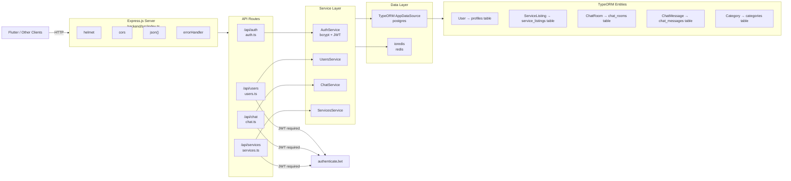
```mermaid
flowchart LR
    subgraph Express["Express.js Server\nbackend/src/index.ts"]
        Helmet["helmet"]
        CORS["cors"]
        JSON["json()"]
        ErrorHandler["errorHandler"]
    end

    subgraph Routes["API Routes"]
        Auth["/api/auth\nauth.ts"]
        Users["/api/users\nusers.ts"]
        Chat["/api/chat\nchat.ts"]
        Services["/api/services\nservices.ts"]
    end

    subgraph ServicesLayerBE["Service Layer"]
        AuthService["AuthService\nbcrypt + JWT"]
        UsersService["UsersService"]
        ChatServiceBE["ChatService"]
        ServicesService["ServicesService"]
    end

    subgraph Data["Data Layer"]
        TypeORM["TypeORM AppDataSource\npostgres"]
        RedisIO["ioredis\nredis"]
    end

    subgraph Entities["TypeORM Entities"]
        User["User → profiles table"]
        ServiceListing["ServiceListing → service_listings table"]
        ChatRoom["ChatRoom → chat_rooms table"]
        ChatMessage["ChatMessage → chat_messages table"]
        Category["Category → categories table"]
    end

    Client["Flutter / Other Clients"] -->|HTTP| Express
    Express --> Routes
    Auth --> AuthService
    Users --> UsersService
    Chat --> ChatServiceBE
    Services --> ServicesService
    ServicesLayerBE --> TypeORM
    ServicesLayerBE --> RedisIO
    TypeORM --> Entities
    Users -->|JWT required| AuthMiddleware["authenticateJwt"]
    Chat -->|JWT required| AuthMiddleware
    Services -->|JWT required| AuthMiddleware
```

---

## 4. Request Lifecycle — REST-First / Supabase Fallback

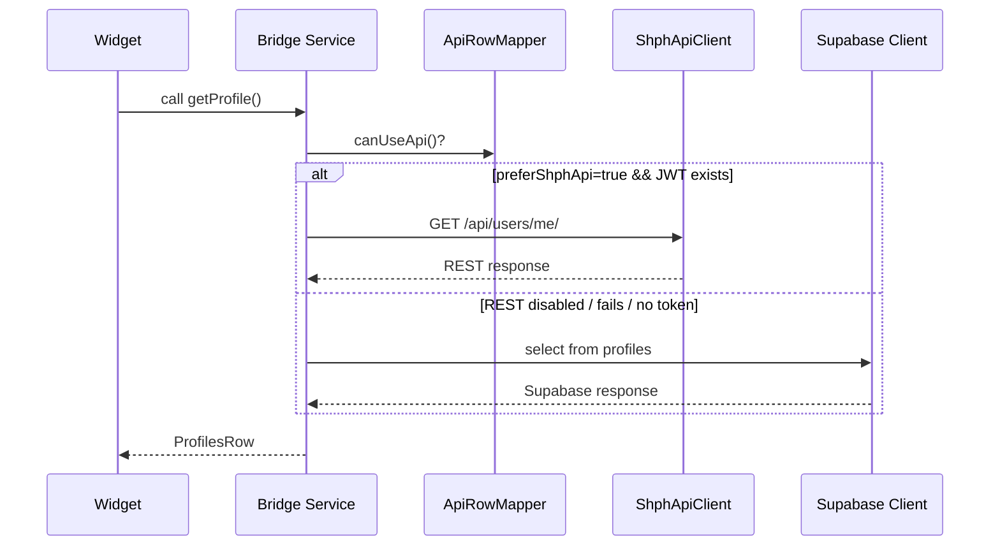
```mermaid
sequenceDiagram
    participant W as Widget
    participant S as Bridge Service
    participant ARM as ApiRowMapper
    participant API as ShphApiClient
    participant SB as Supabase Client

    W->>S: call getProfile()
    S->>ARM: canUseApi()?
    alt preferShphApi=true && JWT exists
        S->>API: GET /api/users/me/
        API-->>S: REST response
    else REST disabled / fails / no token
        S->>SB: select from profiles
        SB-->>S: Supabase response
    end
    S-->>W: ProfilesRow
```

---

## 5. Authentication Flow

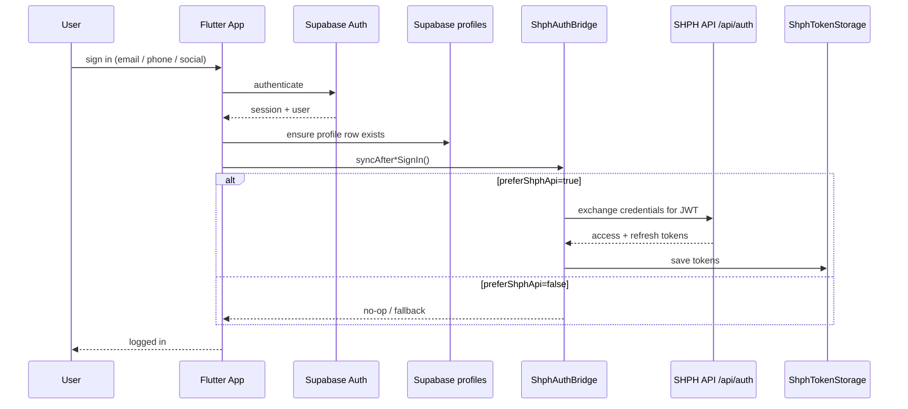
```mermaid
sequenceDiagram
    participant U as User
    participant App as Flutter App
    participant SupabaseAuth as Supabase Auth
    participant SupabaseDB as Supabase profiles
    participant ShphBridge as ShphAuthBridge
    participant ShphAPI as SHPH API /api/auth

    U->>App: sign in (email / phone / social)
    App->>SupabaseAuth: authenticate
    SupabaseAuth-->>App: session + user
    App->>SupabaseDB: ensure profile row exists
    App->>ShphBridge: syncAfter*SignIn()
    alt preferShphApi=true
        ShphBridge->>ShphAPI: exchange credentials for JWT
        ShphAPI-->>ShphBridge: access + refresh tokens
        ShphBridge->>ShphTokenStorage: save tokens
    else preferShphApi=false
        ShphBridge-->>App: no-op / fallback
    end
    App-->>U: logged in
```

---

## 6. Pro Account Verification State Machine

> Enforced by `RoleBasedRedirectGuard` in `lib/router/app_router.dart`.

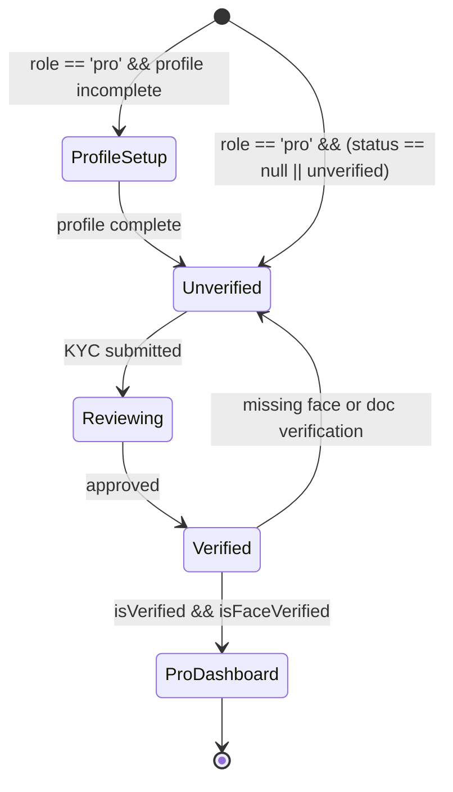
```mermaid
stateDiagram-v2
    [*] --> ProfileSetup: role == 'pro' && profile incomplete
    ProfileSetup --> Unverified: profile complete
    [*] --> Unverified: role == 'pro' && (status == null || unverified)
    Unverified --> Reviewing: KYC submitted
    Reviewing --> Verified: approved
    Verified --> ProDashboard: isVerified && isFaceVerified
    Verified --> Unverified: missing face or doc verification
    ProDashboard --> [*]
```

### Guard Logic Summary

| State | Condition | Redirect |
|---|---|---|
| Incomplete profile | `email == null` or no name or `is_profile_complete != true` | `/pro-profile-setup-form` |
| Unverified | `verification_status` is null/unverified | `/pro-unverified-landing` |
| Reviewing | `verification_status` in `pending`/`reviewing` | `/pro-verification-progress` |
| Fully verified | `verified` + `isVerified` + `isFaceVerified` | `/pro-dashboard` |
| Partially verified | `verified` but missing `isVerified` or `isFaceVerified` | `/pro-unverified-landing` |

---

## 7. Database Schema (Supabase — Primary)

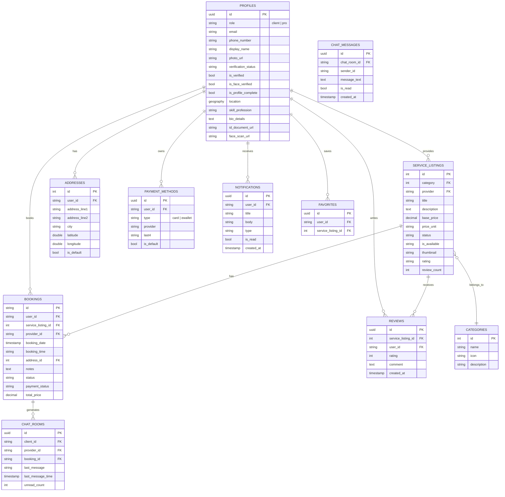
```mermaid
erDiagram
    PROFILES ||--o{ SERVICE_LISTINGS : provides
    PROFILES ||--o{ BOOKINGS : books
    PROFILES ||--o{ REVIEWS : writes
    PROFILES ||--o{ ADDRESSES : has
    PROFILES ||--o{ PAYMENT_METHODS : owns
    PROFILES ||--o{ NOTIFICATIONS : receives
    PROFILES ||--o{ FAVORITES : saves
    SERVICE_LISTINGS ||--o{ BOOKINGS : has
    SERVICE_LISTINGS ||--o{ REVIEWS : receives
    SERVICE_LISTINGS }o--|| CATEGORIES : belongs_to
    BOOKINGS ||--o{ CHAT_ROOMS : generates

    PROFILES {
        uuid id PK
        string role "client | pro"
        string email
        string phone_number
        string display_name
        string photo_url
        string verification_status
        bool is_verified
        bool is_face_verified
        bool is_profile_complete
        geography location
        string skill_profession
        text bio_details
        string id_document_url
        string face_scan_url
    }

    SERVICE_LISTINGS {
        int id PK
        int category FK
        string provider FK
        string title
        text description
        decimal base_price
        string price_unit
        string status
        string is_available
        string thumbnail
        string rating
        int review_count
    }

    BOOKINGS {
        string id PK
        string user_id FK
        int service_listing_id FK
        string provider_id FK
        timestamp booking_date
        string booking_time
        int address_id FK
        text notes
        string status
        string payment_status
        decimal total_price
    }

    CHAT_ROOMS {
        uuid id PK
        string client_id FK
        string provider_id FK
        string booking_id FK
        string last_message
        timestamp last_message_time
        int unread_count
    }

    CHAT_MESSAGES {
        uuid id PK
        string chat_room_id FK
        string sender_id
        text message_text
        bool is_read
        timestamp created_at
    }

    CATEGORIES {
        int id PK
        string name
        string icon
        string description
    }

    REVIEWS {
        uuid id PK
        int service_listing_id FK
        string user_id FK
        int rating
        text comment
        timestamp created_at
    }

    ADDRESSES {
        int id PK
        string user_id FK
        string address_line1
        string address_line2
        string city
        double latitude
        double longitude
        bool is_default
    }

    FAVORITES {
        uuid id PK
        string user_id FK
        int service_listing_id FK
    }

    NOTIFICATIONS {
        uuid id PK
        string user_id FK
        string title
        string body
        string type
        bool is_read
        timestamp created_at
    }

    PAYMENT_METHODS {
        uuid id PK
        string user_id FK
        string type "card | ewallet"
        string provider
        string last4
        bool is_default
    }
```

---

## 8. Main Navigation Flow

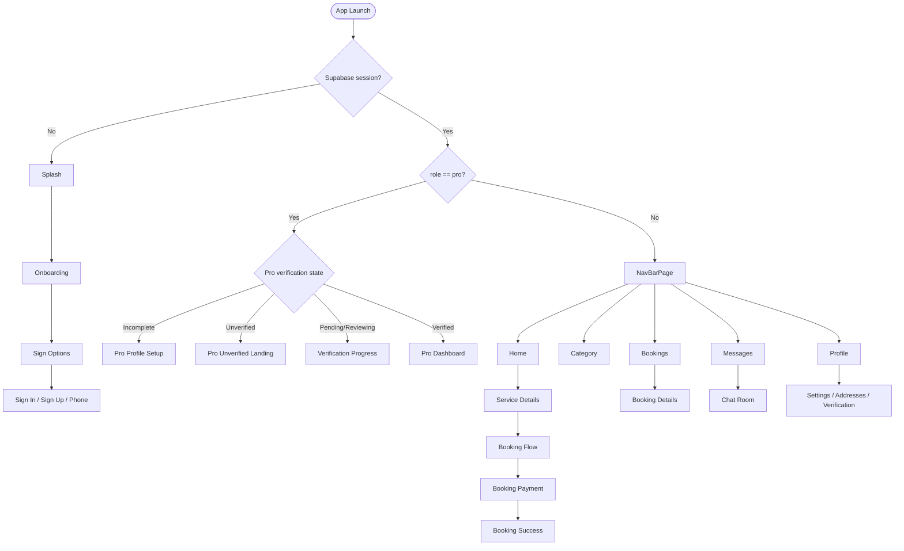
```mermaid
flowchart TD
    A([App Launch]) --> B{Supabase session?}
    B -->|No| C[Splash]
    C --> D[Onboarding]
    D --> E[Sign Options]
    E --> F[Sign In / Sign Up / Phone]
    B -->|Yes| G{role == pro?}
    G -->|No| H[NavBarPage]
    G -->|Yes| I{Pro verification state}
    I -->|Incomplete| J[Pro Profile Setup]
    I -->|Unverified| K[Pro Unverified Landing]
    I -->|Pending/Reviewing| L[Verification Progress]
    I -->|Verified| M[Pro Dashboard]
    H --> N[Home]
    H --> O[Category]
    H --> P[Bookings]
    H --> Q[Messages]
    H --> R[Profile]
    N --> S[Service Details]
    S --> T[Booking Flow]
    T --> U[Booking Payment]
    U --> V[Booking Success]
    P --> W[Booking Details]
    Q --> X[Chat Room]
    R --> Y[Settings / Addresses / Verification]
```

---

## 9. Key Configuration Knobs

| File | Setting | Current Value | Effect |
|---|---|---|---|
| `lib/api/api_config.dart` | `preferShphApi` | `false` | App uses Supabase as primary backend |
| `lib/api/api_config.dart` | `baseUrl` | `https://api.serbisyohub.ph` | SHPH REST API base URL |
| `lib/backend/supabase/supabase.dart` | `url` / `anonKey` | hardcoded | Supabase project connection |
| `backend/.env` | `DATABASE_URL`, `JWT_SECRET`, `REDIS_URL` | environment-specific | Express backend config |
| `backend/src/db/data-source.ts` | `synchronize` | `false` | Migrations required for schema changes |

---

## 10. Deployment Pipeline

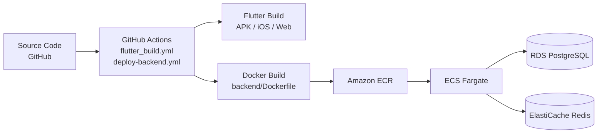
```mermaid
flowchart LR
    Code["Source Code\nGitHub"] --> CI["GitHub Actions\nflutter_build.yml\ndeploy-backend.yml"]
    CI --> Flutter["Flutter Build\nAPK / iOS / Web"]
    CI --> Docker["Docker Build\nbackend/Dockerfile"]
    Docker --> ECR["Amazon ECR"]
    ECR --> ECS["ECS Fargate"]
    ECS --> RDS[(RDS PostgreSQL)]
    ECS --> ElastiCache[(ElastiCache Redis)]
```

---

## 11. Booking Funnel — Detailed Flow

The booking funnel is the primary user journey from service selection to booking confirmation. It supports two urgency modes: **Right Now** (live search) and **Scheduled** (reservation).

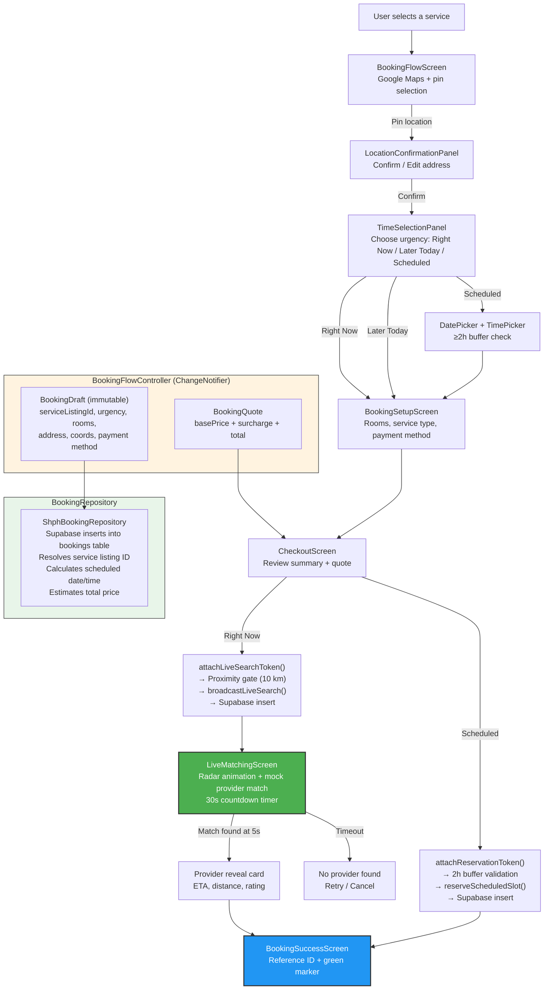
```mermaid
flowchart TD
    Start["User selects a service"] --> FlowScreen["BookingFlowScreen\nGoogle Maps + pin selection"]
    FlowScreen -->|Pin location| ConfirmLoc["LocationConfirmationPanel\nConfirm / Edit address"]
    ConfirmLoc -->|Confirm| TimePanel["TimeSelectionPanel\nChoose urgency: Right Now / Later Today / Scheduled"]
    TimePanel -->|Right Now| SetupConfig["BookingSetupScreen\nRooms, service type, payment method"]
    TimePanel -->|Later Today| SetupConfig
    TimePanel -->|Scheduled| PickDate["DatePicker + TimePicker\n≥2h buffer check"]
    PickDate --> SetupConfig
    SetupConfig --> Checkout["CheckoutScreen\nReview summary + quote"]

    Checkout -->|Right Now| LiveSearch["attachLiveSearchToken()\n→ Proximity gate (10 km)\n→ broadcastLiveSearch()\n→ Supabase insert"]
    Checkout -->|Scheduled| Reserve["attachReservationToken()\n→ 2h buffer validation\n→ reserveScheduledSlot()\n→ Supabase insert"]

    LiveSearch --> LiveMatch["LiveMatchingScreen\nRadar animation + mock provider match\n30s countdown timer"]
    LiveMatch -->|Match found at 5s| MatchReveal["Provider reveal card\nETA, distance, rating"]
    LiveMatch -->|Timeout| NoMatch["No provider found\nRetry / Cancel"]

    Reserve --> Success["BookingSuccessScreen\nReference ID + green marker"]
    MatchReveal --> Success

    subgraph Controller["BookingFlowController (ChangeNotifier)"]
        Draft["BookingDraft (immutable)\nserviceListingId, urgency, rooms,\naddress, coords, payment method"]
        Quote["BookingQuote\nbasePrice + surcharge + total"]
    end

    subgraph Repository["BookingRepository"]
        ShphRepo["ShphBookingRepository\nSupabase inserts into bookings table\nResolves service listing ID\nCalculates scheduled date/time\nEstimates total price"]
    end

    Draft --> ShphRepo
    Quote --> Checkout

    style LiveMatch fill:#4caf50,stroke:#333,stroke-width:2px,color:#fff
    style Success fill:#2196f3,stroke:#333,stroke-width:2px,color:#fff
    style Controller fill:#fff3e0,stroke:#333
    style Repository fill:#e8f5e9,stroke:#333
```

### Booking Funnel Key Files

- **`lib/pages/booking_funnel/booking_controller.dart`** — `BookingFlowController` manages draft state, urgency, rooms, payment, proximity gate (10 km), and calls repository for live search or reservation.
- **`lib/pages/booking_funnel/booking_models.dart`** — `BookingDraft`, `BookingQuote`, `BookingAddress`, enums for `BookingUrgency`, `ServiceType`, `BookingPaymentMethod`.
- **`lib/pages/booking_funnel/booking_repository.dart`** — `ShphBookingRepository` creates Supabase booking records with metadata notes and price estimation.
- **`lib/pages/booking_funnel/booking_flow_screen.dart`** — Map-based location pin UI with `GoogleMap`, location confirmation, and time selection panels.
- **`lib/pages/booking_funnel/checkout/checkout_screen.dart`** — Full checkout review with matching waiting sheet and submit logic.
- **`lib/pages/booking_funnel/express_checkout_screen.dart`** — Express checkout variant; bypasses setup for quick booking; 2-hour buffer check for scheduled bookings using `nearestProviderDistance`.
- **`lib/pages/booking_funnel/live_matching/live_matching_screen.dart`** — Radar animation, mock provider generation, 30s countdown, match reveal at 5s, camera zoom to frame user + provider.
- **`lib/pages/booking_funnel/booking_success_screen.dart`** — Success screen with reference ID, green marker, and return-to-home navigation.

---

## 12. TM (Time & Material) Flow — Detailed State Machine

The TM flow handles urgent on-demand services (locksmith, plumbing, electrical, appliance repair) with a two-stage broadcast search, hardware request approval, job completion, payment, and rating.

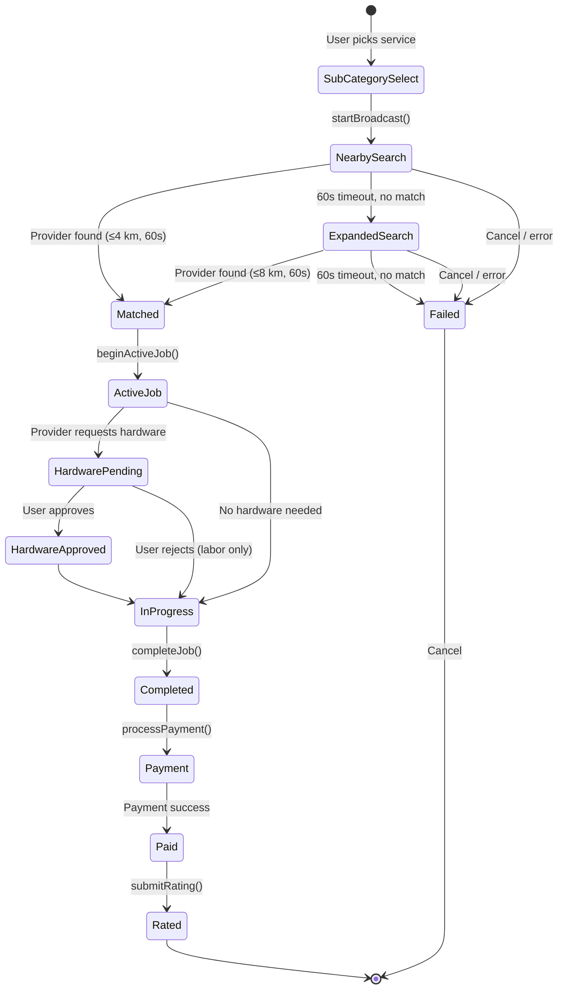
```mermaid
stateDiagram-v2
    [*] --> SubCategorySelect: User picks service
    SubCategorySelect --> NearbySearch: startBroadcast()
    
    NearbySearch --> Matched: Provider found (≤4 km, 60s)
    NearbySearch --> ExpandedSearch: 60s timeout, no match
    NearbySearch --> Failed: Cancel / error
    
    ExpandedSearch --> Matched: Provider found (≤8 km, 60s)
    ExpandedSearch --> Failed: 60s timeout, no match
    ExpandedSearch --> Failed: Cancel / error

    Matched --> ActiveJob: beginActiveJob()
    ActiveJob --> HardwarePending: Provider requests hardware
    ActiveJob --> InProgress: No hardware needed
    HardwarePending --> HardwareApproved: User approves
    HardwarePending --> InProgress: User rejects (labor only)
    HardwareApproved --> InProgress

    InProgress --> Completed: completeJob()
    Completed --> Payment: processPayment()
    Payment --> Paid: Payment success
    Paid --> Rated: submitRating()
    Rated --> [*]

    Failed --> [*]: Cancel
```

### TM Flow Key Components


```mermaid
flowchart TB
    subgraph UI["📱 TM Flow Screens"]
        SubCat["TMSubCategorySelection\nService-specific options"]
        Broadcast["TMBroadcastScreen\nRadar + countdown timer"]
        ActiveJob["TMActiveJobScreen\nProvider info + ETA"]
        Hardware["TMHardwareRequestSheet\nApprove / Reject parts"]
        Payment["TMPaymentScreen\nGCash / Card / Cash"]
        Rating["TMRatingScreen\n1-5 star review"]
    end

    subgraph Controller["🧠 TMFlowController (ChangeNotifier)"]
        Stage["TMBroadcastStage\nidle → nearbySearch → expandedSearch → failed"]
        Ticker["Ticker (60s countdown)\nAuto-expands radius at timeout"]
        Snapshot["Booking Snapshot Stream\nRealtime Supabase subscription"]
        HardwareReq["Hardware Request Stream\nStreamController<TMHardwareRequest>"]
        Invoice["Invoice Calculation\nbaseLaborCost + approvedHardwareCost"]
    end

    subgraph Repository["📦 TMRepository implementations"]
        Mock["PersistentMockTMRepository\nClient-side mock with BookingsService\nSimulated latency for each stage"]
        Dispatch["DispatchTMRepository\nServer-authoritative dispatch\nPolls job_requests table\nFalls back to client-side matching"]
    end

    subgraph Catalog["📋 TM Catalog"]
        TMCatalog["tmSubCategoriesForService()\nLocksmith: 3 options\nPlumbing: 3 options\nElectrical: 3 options\nAppliance: 3 options\nDefault: 3 options"]
    end

    UI --> Controller
    Controller --> Repository
    Catalog --> UI

    style Controller fill:#fff3e0,stroke:#333
    style Dispatch fill:#e3f2fd,stroke:#333,stroke-width:2px
    style Mock fill:#fce4ec,stroke:#333
```

### TM Flow Key Files

- **`lib/pages/tm_flow/tm_controller.dart`** — `TMFlowController` with `TMBroadcastStage` enum, 60s ticker, search cycle IDs for race-condition prevention, snapshot stream subscription, hardware request stream, payment/rating state.
- **`lib/pages/tm_flow/tm_models.dart`** — `TMSubCategoryOption`, `TMProviderProfile`, `TMHardwareRequest`, `TMBookingSnapshot`.
- **`lib/pages/tm_flow/tm_repository.dart`** — `TMRepository` abstract + `PersistentMockTMRepository` (client-side mock with simulated latency) + real provider matching via Supabase `profiles` query with proximity scoring.
- **`lib/pages/tm_flow/tm_catalog.dart`** — Service-specific sub-category generation based on service title/category fingerprint matching.
- **`lib/pages/tm_flow/tm_payment_screen.dart`** — Payment method selection (GCash, Card, Cash on Completion) with invoice display.

---

## 13. Dispatch System — Server-Authoritative Matching

The dispatch system provides server-side provider matching using `job_requests`, `dispatch_offers`, and the `match_best_provider` PostgreSQL function, with a Supabase Edge Function for timeout management.

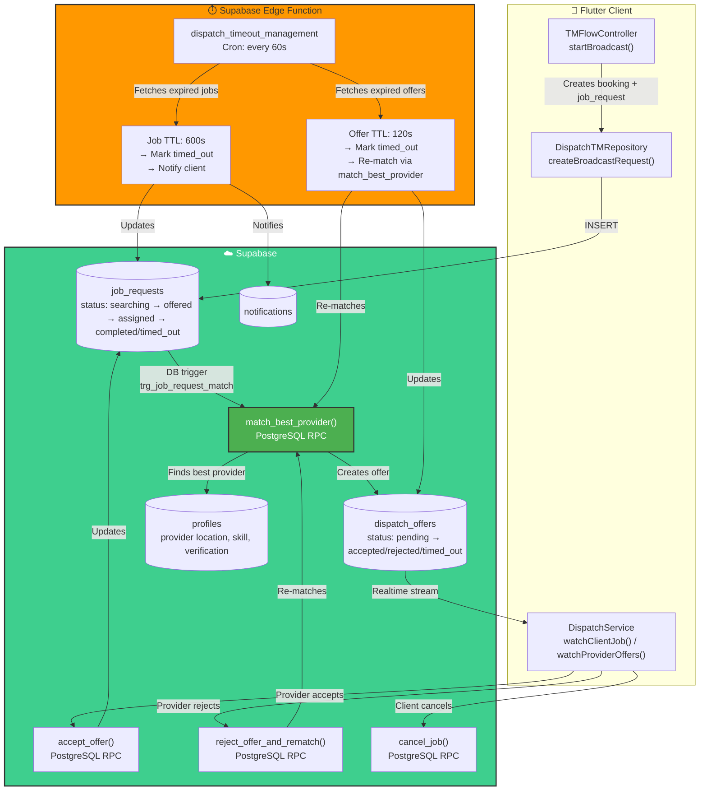
```mermaid
flowchart TD
    subgraph Client["📱 Flutter Client"]
        TMController["TMFlowController\nstartBroadcast()"]
        DispatchRepo["DispatchTMRepository\ncreateBroadcastRequest()"]
        DispatchService["DispatchService\nwatchClientJob() / watchProviderOffers()"]
    end

    subgraph Supabase["☁️ Supabase"]
        JobRequests[("job_requests\nstatus: searching → offered → assigned → completed/timed_out")]
        DispatchOffers[("dispatch_offers\nstatus: pending → accepted/rejected/timed_out")]
        MatchFunc["match_best_provider()\nPostgreSQL RPC"]
        AcceptFunc["accept_offer()\nPostgreSQL RPC"]
        RejectFunc["reject_offer_and_rematch()\nPostgreSQL RPC"]
        CancelFunc["cancel_job()\nPostgreSQL RPC"]
        Profiles[("profiles\nprovider location, skill, verification")]
        Notifications[("notifications")]
    end

    subgraph EdgeFunction["⏱️ Supabase Edge Function"]
        TimeoutMgmt["dispatch_timeout_management\nCron: every 60s"]
        OfferTimeout["Offer TTL: 120s\n→ Mark timed_out\n→ Re-match via match_best_provider"]
        JobTimeout["Job TTL: 600s\n→ Mark timed_out\n→ Notify client"]
    end

    TMController -->|Creates booking + job_request| DispatchRepo
    DispatchRepo -->|INSERT| JobRequests
    JobRequests -->|DB trigger\ntrg_job_request_match| MatchFunc
    MatchFunc -->|Finds best provider| Profiles
    MatchFunc -->|Creates offer| DispatchOffers

    DispatchOffers -->|Realtime stream| DispatchService
    DispatchService -->|Provider accepts| AcceptFunc
    AcceptFunc -->|Updates| JobRequests
    DispatchService -->|Provider rejects| RejectFunc
    RejectFunc -->|Re-matches| MatchFunc
    DispatchService -->|Client cancels| CancelFunc

    TimeoutMgmt -->|Fetches expired offers| OfferTimeout
    OfferTimeout -->|Updates| DispatchOffers
    OfferTimeout -->|Re-matches| MatchFunc
    TimeoutMgmt -->|Fetches expired jobs| JobTimeout
    JobTimeout -->|Updates| JobRequests
    JobTimeout -->|Notifies| Notifications

    style MatchFunc fill:#4caf50,stroke:#333,stroke-width:2px,color:#fff
    style EdgeFunction fill:#ff9800,stroke:#333,stroke-width:2px
    style Supabase fill:#3ecf8e,stroke:#333,stroke-width:2px,color:#fff
```

### Dispatch System Fallback Mechanism

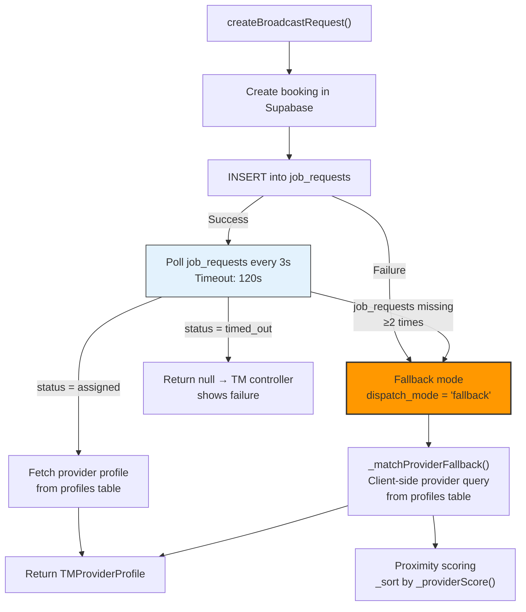
```mermaid
flowchart TD
    Start["createBroadcastRequest()"] --> CreateBooking["Create booking in Supabase"]
    CreateBooking --> CreateJobReq["INSERT into job_requests"]
    CreateJobReq -->|Success| PollLoop["Poll job_requests every 3s\nTimeout: 120s"]
    CreateJobReq -->|Failure| Fallback["Fallback mode\ndispatch_mode = 'fallback'"]

    PollLoop -->|status = assigned| FetchProfile["Fetch provider profile\nfrom profiles table"]
    PollLoop -->|status = timed_out| ReturnNull["Return null → TM controller\nshows failure"]
    PollLoop -->|job_requests missing\n≥2 times| Fallback

    Fallback --> ClientMatch["_matchProviderFallback()\nClient-side provider query\nfrom profiles table"]
    ClientMatch --> ProximityScore["Proximity scoring\n_sort by _providerScore()"]

    FetchProfile --> ReturnProvider["Return TMProviderProfile"]
    ClientMatch --> ReturnProvider

    style Fallback fill:#ff9800,stroke:#333,stroke-width:2px
    style PollLoop fill:#e3f2fd,stroke:#333
```

### Dispatch System Key Files

- **`lib/services/dispatch/dispatch_service.dart`** — `DispatchService` singleton with `createJob`, `cancelJob`, `watchClientJob` (realtime stream), `watchProviderOffers`, `acceptOffer`, `rejectOffer`, `completeJob`.
- **`lib/services/dispatch/dispatch_models.dart`** — `DispatchJobRequest`, `DispatchOffer`, `ClientJobView`, `ProviderOfferView`, enums for `DispatchStatus` and `OfferStatus`.
- **`lib/pages/dispatch/dispatch_repository.dart`** — `DispatchTMRepository` implements `TMRepository`; creates booking + job_request, polls for server-side match, falls back to client-side matching with proximity scoring.
- **`supabase/functions/dispatch_timeout_management/index.ts`** — Deno Edge Function; cron-triggered every 60s; times out pending offers (120s TTL) and searching jobs (600s TTL); re-matches via `match_best_provider` RPC; sends in-app notifications.

---

## 14. Pro Verification / EKYC Flow

The pro verification flow is a multi-step EKYC (Electronic Know Your Customer) process required for providers before they can accept jobs. The router enforces a 4-state lifecycle redirect guard.

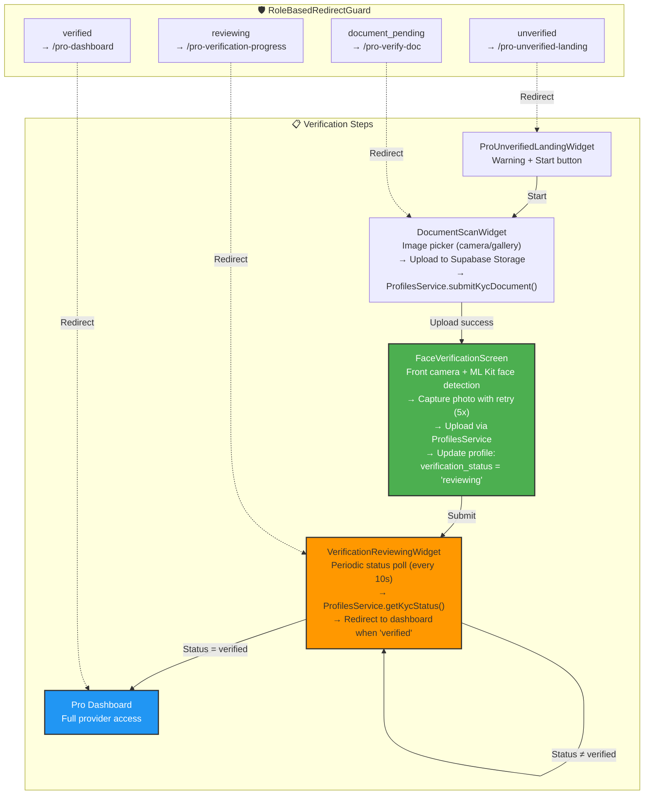
```mermaid
flowchart TD
    subgraph RouterGuard["🛡️ RoleBasedRedirectGuard"]
        State1["unverified\n→ /pro-unverified-landing"]
        State2["document_pending\n→ /pro-verify-doc"]
        State3["reviewing\n→ /pro-verification-progress"]
        State4["verified\n→ /pro-dashboard"]
    end

    subgraph Flow["📋 Verification Steps"]
        Landing["ProUnverifiedLandingWidget\nWarning + Start button"]
        DocScan["DocumentScanWidget\nImage picker (camera/gallery)\n→ Upload to Supabase Storage\n→ ProfilesService.submitKycDocument()"]
        FaceVerify["FaceVerificationScreen\nFront camera + ML Kit face detection\n→ Capture photo with retry (5x)\n→ Upload via ProfilesService\n→ Update profile: verification_status = 'reviewing'"]
        Reviewing["VerificationReviewingWidget\nPeriodic status poll (every 10s)\n→ ProfilesService.getKycStatus()\n→ Redirect to dashboard when 'verified'"]
        Dashboard["Pro Dashboard\nFull provider access"]
    end

    Landing -->|Start| DocScan
    DocScan -->|Upload success| FaceVerify
    FaceVerify -->|Submit| Reviewing
    Reviewing -->|Status = verified| Dashboard
    Reviewing -->|Status ≠ verified| Reviewing

    State1 -.->|Redirect| Landing
    State2 -.->|Redirect| DocScan
    State3 -.->|Redirect| Reviewing
    State4 -.->|Redirect| Dashboard

    style FaceVerify fill:#4caf50,stroke:#333,stroke-width:2px,color:#fff
    style Reviewing fill:#ff9800,stroke:#333,stroke-width:2px
    style Dashboard fill:#2196f3,stroke:#333,stroke-width:2px,color:#fff
```

### Pro Verification Key Files

- **`lib/pages/pro_verification/pro_unverified_landing_widget.dart`** — Landing page with warning icon and CTA to start verification.
- **`lib/pages/pro_verification/document_scan_widget.dart`** — Document capture via `ImagePicker` (camera or gallery, 85% quality, max 2048px), upload via `ProfilesService.submitKycDocument()`, navigates to face verification on success.
- **`lib/pages/pro_verification/face_verification_screen.dart`** — Front camera initialization, `google_mlkit_face_detection` for real-time face detection overlay, capture with 5-retry logic, upload via `ProfilesService.uploadProfilePhoto()`, updates profile `verification_status` to `'reviewing'`, marks verified locally via `FaceVerificationService.markAsVerified()`.
- **`lib/pages/pro_verification/verification_reviewing_widget.dart`** — Progress screen with periodic status polling every 10 seconds via `ProfilesService.getKycStatus()`; redirects to Pro Dashboard when status becomes `'verified'`.
- **`lib/services/face_verification/face_verification_service.dart`** — `SharedPreferences`-based local verification tracking with session expiry management.
- **`lib/router/app_router.dart`** — `RoleBasedRedirectGuard.checkRedirect()` enforces 4-state lifecycle.

---

## 15. Payment System — Stripe & Maya Integration

The payment system supports multiple payment methods: Stripe (card payments), Maya (e-wallet), GCash, and Cash on Completion. Payment methods are persisted in Supabase.

```mermaid
flowchart TB
    subgraph Flutter["📱 Flutter App"]
        PaymentController["PaymentController (singleton)\ninitializeStripe() → Stripe.publishableKey"]
        StripePay["processStripePayment()\n→ Fetch client secret from backend\n→ Stripe.instance.initPaymentSheet()\n→ Stripe.instance.presentPaymentSheet()"]
        MayaPay["processMayaPayment()\n→ Fetch checkout URL from backend\n→ Return checkout URL for redirect"]
        TMPayment["TMPaymentScreen\nGCash / Card / Cash on Completion"]
        PaymentMethods["PaymentMethodsWidget\nManage saved cards & e-wallets"]
        AddCard["AddCardPaymentWidget\nCard form (number, expiry, provider)"]
        AddEwallet["AddEwalletPaymentWidget\nE-wallet form (phone, provider)"]
    end

    subgraph Backend["☁️ Backend API"]
        StripeIntent["POST /api/payments/stripe/create-intent\nReturns: client_secret"]
        MayaCheckout["POST /api/payments/maya/create-checkout\nReturns: checkout_url"]
    end

    subgraph Supabase["☁️ Supabase"]
        PaymentMethodsTable[("payment_methods\nid, user_id, type, provider,\nlast_four, expiry, is_default")]
        BookingsTable[("bookings\npayment_status, total_price")]
    end

    subgraph External["🌐 External Services"]
        StripeAPI["Stripe API\nPaymentIntents"]
        MayaAPI["Maya Checkout API"]
    end

    StripePay -->|POST amount × 100| StripeIntent
    StripeIntent -->|client_secret| StripePay
    StripePay -->|Presents sheet| StripeAPI

    MayaPay -->|POST amount| MayaCheckout
    MayaCheckout -->|checkout_url| MayaPay
    MayaPay --> MayaAPI

    TMPayment -->|processPayment()| TMRepo["TMRepository.processPayment()\nUpdates booking payment_status"]

    PaymentMethods -->|CRUD| PaymentMethodsTable
    AddCard -->|INSERT/UPDATE| PaymentMethodsTable
    AddEwallet -->|INSERT/UPDATE| PaymentMethodsTable

    style PaymentController fill:#e3f2fd,stroke:#333,stroke-width:2px
    style StripeAPI fill:#635bff,stroke:#333,stroke-width:2px,color:#fff
    style MayaAPI fill:#33c47e,stroke:#333,stroke-width:2px,color:#fff
```

### Payment System Key Files

- **`lib/services/payment_controller.dart`** — `PaymentController` singleton; `processStripePayment()` fetches client secret from backend, initializes and presents Stripe payment sheet; `processMayaPayment()` fetches Maya checkout URL; handles `StripeException` with cancel detection.
- **`lib/pages/tm_flow/tm_payment_screen.dart`** — TM payment UI with GCash, Card, Cash on Completion options; displays `totalInvoiceAmount` (baseLaborCost + approvedHardwareCost).
- **`lib/main/payment_methods/payment_methods_widget.dart`** — Full payment methods management UI with skeleton loading, empty/error states, card display, set-default, edit, delete.
- **`lib/main/payment_methods/payment_methods_model.dart`** — `loadPaymentMethods()`, `setAsDefault()`, `deletePaymentMethod()` with auto-promotion of next default.
- **`lib/main/payment_methods/add_card_payment_widget.dart`** — Card entry form with provider selection, card number, expiry, default toggle; INSERT or UPDATE to `payment_methods` table.
- **`lib/backend/supabase/database/tables/payment_methods.dart`** — `PaymentMethodsRow` with fields: id, userId, type, provider, lastFour, expiryMonth/Year, phoneNumber, accountName, isDefault.

---

## 16. PSGC Service — Philippine Standard Geographic Code

The PSGC service provides cascading geographic selection for Philippine addresses: Region → Province → City/Municipality → Barangay, using the public PSGC API.

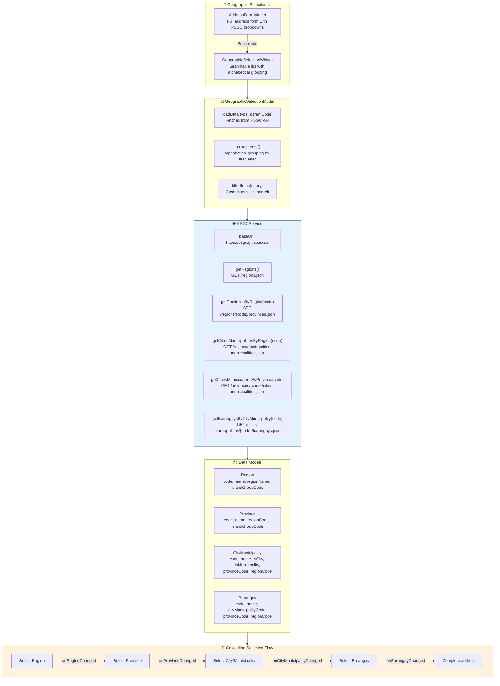
```mermaid
flowchart TD
    subgraph UI["📱 Geographic Selection UI"]
        AddressForm["AddressFormWidget\nFull address form with PSGC dropdowns"]
        GeoSelect["GeographicSelectionWidget\nSearchable list with alphabetical grouping"]
    end

    subgraph Model["🧠 GeographicSelectionModel"]
        LoadData["loadData(type, parentCode)\nFetches from PSGC API"]
        GroupItems["_groupItems()\nAlphabetical grouping by first letter"]
        Filter["filterItems(query)\nCase-insensitive search"]
    end

    subgraph Service["🌐 PSGCService"]
        BaseUrl["baseUrl: https://psgc.gitlab.io/api"]
        GetRegions["getRegions()\nGET /regions.json"]
        GetProvinces["getProvincesByRegion(code)\nGET /regions/{code}/provinces.json"]
        GetCities["getCitiesMunicipalitiesByRegion(code)\nGET /regions/{code}/cities-municipalities.json"]
        GetCitiesProv["getCitiesMunicipalitiesByProvince(code)\nGET /provinces/{code}/cities-municipalities.json"]
        GetBarangays["getBarangaysByCityMunicipality(code)\nGET /cities-municipalities/{code}/barangays.json"]
    end

    subgraph Models["📦 Data Models"]
        Region["Region\ncode, name, regionName, islandGroupCode"]
        Province["Province\ncode, name, regionCode, islandGroupCode"]
        CityMun["CityMunicipality\ncode, name, isCity, isMunicipality,\nprovinceCode, regionCode"]
        Barangay["Barangay\ncode, name, cityMunicipalityCode,\nprovinceCode, regionCode"]
    end

    subgraph Flow["🔄 Cascading Selection Flow"]
        R["Select Region"] -->|onRegionChanged| P["Select Province"]
        P -->|onProvinceChanged| C["Select City/Municipality"]
        C -->|onCityMunicipalityChanged| B["Select Barangay"]
        B -->|onBarangayChanged| Done["Complete address"]
    end

    AddressForm -->|Push route| GeoSelect
    GeoSelect --> Model
    Model --> Service
    Service --> Models
    Models --> Flow

    style Service fill:#e3f2fd,stroke:#333,stroke-width:2px
    style Flow fill:#fff3e0,stroke:#333
```

### PSGC Key Details

- **NCR Fallback**: When a region has no provinces (e.g., NCR), city/municipality selection falls back to region-level using `isRegionFallback` flag.
- **`compute()` parsing**: JSON parsing runs in isolate via `compute()` for performance with large datasets.
- **Alphabetical grouping**: `GeographicSelectionModel._groupItems()` groups items by first letter for easy scrolling.
- **Search**: Real-time case-insensitive filtering within loaded items.

### PSGC Key Files

- **`lib/services/psgc_service.dart`** — `PSGCService` static class with 5 API methods; data models: `Region`, `Province`, `CityMunicipality`, `Barangay`.
- **`lib/pages/geographic_selection/geographic_selection_model.dart`** — `GeographicSelectionModel` (ChangeNotifier) with loading state, grouping, filtering; `GeographicSelectionType` enum.
- **`lib/pages/geographic_selection/geographic_selection_widget.dart`** — Searchable list UI with alphabetical sections, tap-to-select returning selected item via `Navigator.pop()`.
- **`lib/pages/address_form/address_form_model.dart`** — `AddressFormModel` with PSGC fields (regions, provinces, cities, barangays), cascading change handlers, loading states.
- **`lib/pages/address_form/address_form_widget.dart`** — Full address form with label chips (Home, Work, Other), PSGC dropdown navigation, map for coordinates.

---

## 17. Nearby Provider & Proximity Scoring

The proximity scoring system ranks providers by a composite score combining skill match, verification status, and geographic distance.

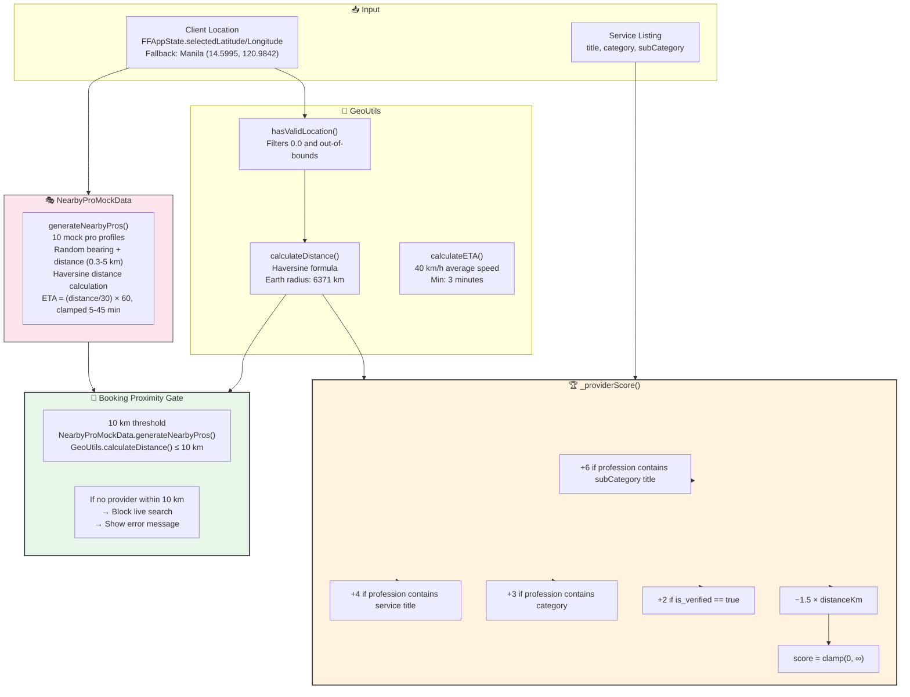
```mermaid
flowchart TB
    subgraph Input["📥 Input"]
        ClientLoc["Client Location\nFFAppState.selectedLatitude/Longitude\nFallback: Manila (14.5995, 120.9842)"]
        Service["Service Listing\ntitle, category, subCategory"]
    end

    subgraph GeoUtils["📐 GeoUtils"]
        Validate["hasValidLocation()\nFilters 0.0 and out-of-bounds"]
        Haversine["calculateDistance()\nHaversine formula\nEarth radius: 6371 km"]
        ETA["calculateETA()\n40 km/h average speed\nMin: 3 minutes"]
    end

    subgraph Scoring["🏆 _providerScore()"]
        SkillSub["+6 if profession contains subCategory title"]
        SkillService["+4 if profession contains service title"]
        SkillCategory["+3 if profession contains category"]
        Verified["+2 if is_verified == true"]
        DistancePenalty["−1.5 × distanceKm"]
        Clamp["score = clamp(0, ∞)"]
    end

    subgraph MockData["🎭 NearbyProMockData"]
        Generate["generateNearbyPros()\n10 mock pro profiles\nRandom bearing + distance (0.3-5 km)\nHaversine distance calculation\nETA = (distance/30) × 60, clamped 5-45 min"]
    end

    subgraph ProximityGate["🚦 Booking Proximity Gate"]
        Threshold["10 km threshold\nNearbyProMockData.generateNearbyPros()\nGeoUtils.calculateDistance() ≤ 10 km"]
        Gate["If no provider within 10 km\n→ Block live search\n→ Show error message"]
    end

    ClientLoc --> Validate
    Validate --> Haversine
    Haversine --> Scoring
    Service --> Scoring
    Scoring --> SkillSub
    Scoring --> SkillService
    Scoring --> SkillCategory
    Scoring --> Verified
    Scoring --> DistancePenalty
    DistancePenalty --> Clamp

    ClientLoc --> MockData
    MockData --> ProximityGate
    Haversine --> ProximityGate

    style Scoring fill:#fff3e0,stroke:#333,stroke-width:2px
    style MockData fill:#fce4ec,stroke:#333
    style ProximityGate fill:#e8f5e9,stroke:#333,stroke-width:2px
```

### Proximity Scoring Formula

```
score = (6 if profession ⊇ subCategoryTitle) +
        (4 if profession ⊇ serviceTitle) +
        (3 if profession ⊇ category) +
        (2 if is_verified) -
        (1.5 × distanceKm)
```

Providers are sorted by score descending. The highest-scoring provider is selected as the match.

### Proximity Scoring Key Files

- **`lib/utils/geo_utils.dart`** — `GeoUtils` with `hasValidLocation()`, `calculateDistance()` (Haversine), `calculateETA()` (40 km/h assumption, 3-min minimum), Manila fallback coordinates.
- **`lib/services/nearby_pro_mock_data.dart`** — `NearbyProMockData` singleton; 10 mock pro profiles with Filipino names and Unsplash photos; generates nearby pros with random bearing/distance around client location; includes `haversineDistance()` for distance calculation.
- **`lib/pages/booking_funnel/booking_controller.dart`** — Proximity gate in `attachLiveSearchToken()` checks if any mock provider is within 10 km before allowing live search.
- **`lib/pages/tm_flow/tm_repository.dart`** — `_findRealProvider()` queries `profiles` table for providers, filters by radius, sorts by `_providerScore()`.
- **`lib/pages/dispatch/dispatch_repository.dart`** — Same `_providerScore()` and `_isEligibleProvider()` logic for fallback matching.

---

## 18. Supabase Edge Functions & Firebase Functions

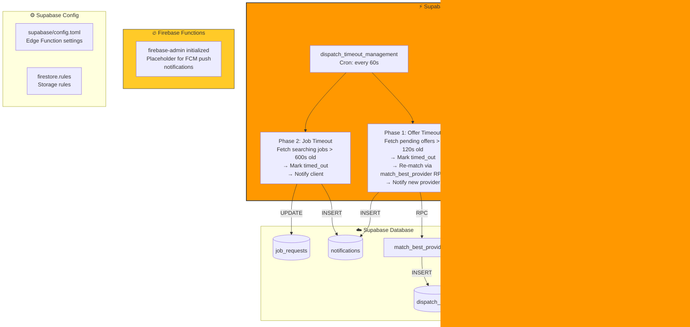
```mermaid
flowchart TB
    subgraph SupabaseEdge["⚡ Supabase Edge Functions (Deno)"]
        DispatchTimeout["dispatch_timeout_management\nCron: every 60s"]
        Phase1["Phase 1: Offer Timeout\nFetch pending offers > 120s old\n→ Mark timed_out\n→ Re-match via match_best_provider RPC\n→ Notify new provider"]
        Phase2["Phase 2: Job Timeout\nFetch searching jobs > 600s old\n→ Mark timed_out\n→ Notify client"]
        Notifications["Notification Types\nnew_offer, offer_expired,\njob_timed_out, job_assigned"]
        Security["Security: CRON_SECRET\nor service_role key\nDev mode: allow all"]
    end

    subgraph SupabaseDB["☁️ Supabase Database"]
        JobRequests[("job_requests")]
        DispatchOffers[("dispatch_offers")]
        NotificationsTable[("notifications")]
        MatchRPC["match_best_provider()"]
    end

    subgraph Firebase["🔥 Firebase Functions"]
        FirebaseInit["firebase-admin initialized\nPlaceholder for FCM push\nnotifications"]
    end

    subgraph Config["⚙️ Supabase Config"]
        ConfigToml["supabase/config.toml\nEdge Function settings"]
        FirestoreRules["firestore.rules\nStorage rules"]
    end

    DispatchTimeout --> Phase1
    DispatchTimeout --> Phase2
    Phase1 -->|UPDATE| DispatchOffers
    Phase1 -->|RPC| MatchRPC
    MatchRPC -->|INSERT| DispatchOffers
    Phase1 -->|INSERT| NotificationsTable
    Phase2 -->|UPDATE| JobRequests
    Phase2 -->|INSERT| NotificationsTable

    style SupabaseEdge fill:#ff9800,stroke:#333,stroke-width:2px
    style Firebase fill:#ffca28,stroke:#333
```

### Edge Function Configuration

| Setting | Value | Description |
|---|---|---|
| `OFFER_TTL_SECONDS` | 120 | Offers expire after 2 minutes |
| `JOB_TTL_SECONDS` | 600 | Jobs expire after 10 minutes |
| `BATCH_SIZE` | 50 | Max records processed per cycle |
| `CRON_SECRET` | env var | Optional auth token for cron |
| Schedule | every 60s | Cron-triggered |

### Edge Function Key Files

- **`supabase/functions/dispatch_timeout_management/index.ts`** — Deno-based Edge Function using `serve()` from std/http; creates Supabase client with service_role key; idempotent operations (only processes non-terminal records); batch processing with `Promise.allSettled()`.
- **`supabase/config.toml`** — Supabase project configuration.
- **`firebase/functions/index.js`** — Minimal Firebase Functions setup with `firebase-admin` initialized; placeholder for FCM push notifications.
- **`firebase/firebase.json`** — Firebase project configuration.
- **`firebase/firestore.rules`** / **`firebase/storage.rules`** — Security rules for Firestore and Storage.

---

## 19. Express Checkout vs Full Checkout

The app provides two checkout paths: a full multi-step booking funnel and an express checkout for quick booking from a service card.

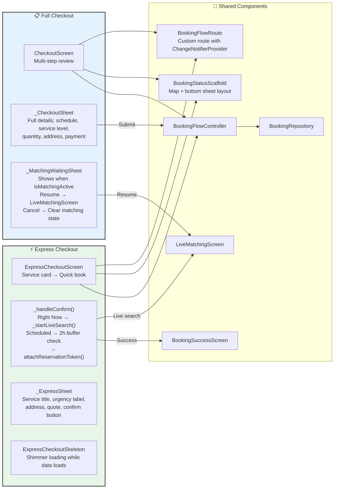
```mermaid
flowchart LR
    subgraph Express["⚡ Express Checkout"]
        ExpressScreen["ExpressCheckoutScreen\nService card → Quick book"]
        ExpressConfirm["_handleConfirm()\nRight Now → _startLiveSearch()\nScheduled → 2h buffer check\n→ attachReservationToken()"]
        ExpressSheet["_ExpressSheet\nService title, urgency label,\naddress, quote, confirm button"]
        ExpressSkeleton["ExpressCheckoutSkeleton\nShimmer loading while data loads"]
    end

    subgraph Full["📋 Full Checkout"]
        FullScreen["CheckoutScreen\nMulti-step review"]
        FullSheet["_CheckoutSheet\nFull details: schedule, service level,\nquantity, address, payment"]
        MatchingSheet["_MatchingWaitingSheet\nShows when isMatchingActive\nResume → LiveMatchingScreen\nCancel → Clear matching state"]
    end

    subgraph Shared["🔄 Shared Components"]
        Controller["BookingFlowController"]
        Repo["BookingRepository"]
        Success["BookingSuccessScreen"]
        LiveMatch["LiveMatchingScreen"]
        Scaffold["BookingStatusScaffold\nMap + bottom sheet layout"]
        Route["BookingFlowRoute\nCustom route with ChangeNotifierProvider"]
    end

    ExpressScreen --> Controller
    FullScreen --> Controller
    Controller --> Repo
    ExpressConfirm -->|Success| Success
    ExpressConfirm -->|Live search| LiveMatch
    FullSheet -->|Submit| Controller
    MatchingSheet -->|Resume| LiveMatch
    ExpressScreen --> Scaffold
    FullScreen --> Scaffold
    ExpressScreen --> Route
    FullScreen --> Route

    style Express fill:#e8f5e9,stroke:#333,stroke-width:2px
    style Full fill:#e3f2fd,stroke:#333,stroke-width:2px
```

### Express Checkout 2-Hour Buffer Logic

When booking a scheduled service via express checkout:
1. Calculate `scheduledDateTime` from draft's `scheduledDate` + `scheduledTime`
2. If `diffMinutes < 120` (less than 2 hours away):
   - Check `appState.nearestProviderDistance`
   - If `> 4.0 km`: show warning snackbar ("closest professional needs at least 2 hours")
   - If `≤ 4.0 km`: allow reservation
3. If `≥ 120 minutes`: proceed with `attachReservationToken()`

---

## 20. TM Flow — Realtime Snapshot Sync

The TM controller maintains realtime sync with the booking record via Supabase streams, applying snapshots to update provider match, dispatch mode, hardware requests, and job stage.

```mermaid
sequenceDiagram
    participant UI as TM UI Screens
    participant Controller as TMFlowController
    participant Repo as TMRepository
    participant Supabase as Supabase

    UI->>Controller: startBroadcast()
    Controller->>Controller: _searchCycleId++, reset state
    Controller->>Controller: _startTicker() (60s countdown)
    Controller->>Repo: createBroadcastRequest()
    Repo->>Supabase: INSERT booking + job_request
    Supabase-->>Repo: booking.id
    Controller->>Repo: watchBookingSnapshot(requestId)
    Repo->>Supabase: stream(primaryKey: ['id']).eq('id', requestId)
    Controller->>Repo: findProvider()
    Repo->>Supabase: Poll job_requests (every 3s, 120s timeout)

    alt Server matches provider
        Supabase-->>Repo: status = 'assigned', provider_id
        Repo-->>Controller: TMProviderProfile
        Controller->>Controller: _matchedProvider = provider
        Controller->>UI: notifyListeners() → show match
    else 60s timeout (nearby)
        Controller->>Controller: Expand to 8 km, attempt 2
        Controller->>Repo: findProvider(expanded)
    else 120s timeout (expanded)
        Controller->>Controller: _broadcastStage = failed
        Controller->>UI: Show failure UI
    end

    Note over Controller,Supabase: Realtime snapshot stream
    Supabase-->>Controller: TMBookingSnapshot
    Controller->>Controller: _applySnapshot()
    Controller->>Controller: Update provider, dispatch mode,\nhardware request, stage, payment status
    Controller->>UI: notifyListeners() if shouldNotify
```

### Snapshot Stage Transitions

| Snapshot Stage | Controller Action |
|---|---|
| `cancelled` | Stop ticker, set `failed` stage |
| `matched` / `provider_accepted` / `in_progress` | Stop ticker, set `idle` stage |
| `hardware_pending` / `hardware_approved` | Emit hardware request via stream |
| `completed` | Set `_jobCompleted = true` |
| `paid` | Clear `_isProcessingPayment` |

---

## 21. Complete Data Model Relationships

```mermaid
erDiagram
    profiles ||--o{ service_listings : "provider creates"
    profiles ||--o{ bookings : "client books"
    profiles ||--o{ bookings : "provider accepts"
    profiles ||--o{ payment_methods : "user owns"
    profiles ||--o{ job_requests : "client creates"
    profiles ||--o{ dispatch_offers : "provider receives"
    profiles ||--o{ notifications : "user receives"

    service_listings ||--o{ bookings : "service booked"
    bookings ||--o| job_requests : "linked booking"
    job_requests ||--o{ dispatch_offers : "offers for job"

    profiles {
        uuid id PK
        text email
        text phone
        text display_name
        text role "client/provider/admin"
        text verification_status "unverified/pending/reviewing/verified"
        text skill_profession
        float8 latitude
        float8 longitude
        boolean is_verified
        text face_scan_url
        timestamptz face_scan_submitted_at
    }

    service_listings {
        int id PK
        text title
        text category
        text description
        numeric base_price
        text price_unit
        text status
        int provider_id FK
    }

    bookings {
        uuid id PK
        uuid user_id FK
        int service_listing_id FK
        uuid provider_id FK
        date booking_date
        time booking_time
        text status "pending/accepted/completed/cancelled"
        text payment_status "tm_pending/paid/cash"
        numeric total_price
        text notes "JSON metadata: TM_META:{...}"
    }

    job_requests {
        uuid id PK
        uuid client_id FK
        text service_type
        float8 location_lat
        float8 location_lng
        timestamptz requested_time
        text status "searching/offered/assigned/completed/timed_out/cancelled"
        uuid assigned_provider_id FK
        uuid booking_id FK
    }

    dispatch_offers {
        uuid id PK
        uuid job_id FK
        uuid provider_id FK
        text status "pending/accepted/rejected/timed_out"
        timestamptz offered_at
        timestamptz responded_at
    }

    payment_methods {
        uuid id PK
        uuid user_id FK
        text type "card/ewallet"
        text provider
        text last_four
        text expiry_month
        text expiry_year
        text phone_number
        boolean is_default
    }

    notifications {
        uuid id PK
        uuid user_id FK
        text title
        text body
        text type
        jsonb metadata
        boolean is_read
    }
```

### Booking Notes Metadata Format

TM flow stores rich metadata in the booking `notes` field using a `TM_META:` prefix:

```json
{
  "TM_META": {
    "flow": "tm",
    "stage": "broadcast|matched|hardware_pending|hardware_approved|in_progress|completed|paid|cancelled",
    "search_radius_km": 4,
    "search_attempt": 1,
    "sub_category_id": "pipe_leak",
    "sub_category_title": "Pipe Leak Repair",
    "estimate_min": 500,
    "estimate_max": 850,
    "dispatch_mode": "server|fallback",
    "provider": {
      "id": "uuid",
      "name": "Provider Name",
      "specialty": "Plumbing",
      "eta_minutes": 12,
      "latitude": 14.5995,
      "longitude": 120.9842
    },
    "hardware_request": {
      "id": "hardware-1-pipe_leak",
      "title": "Hardware Parts Required",
      "additional_cost": 350
    }
  }
}
```

